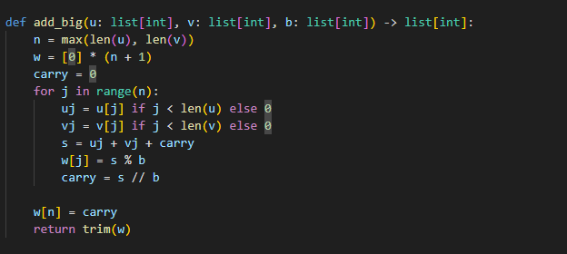
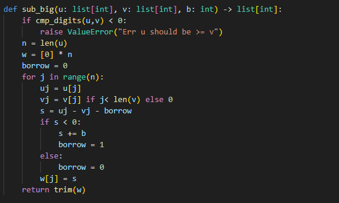
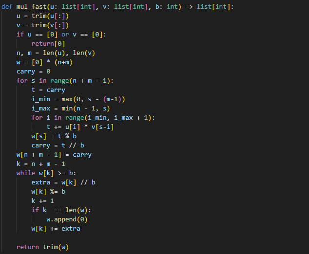
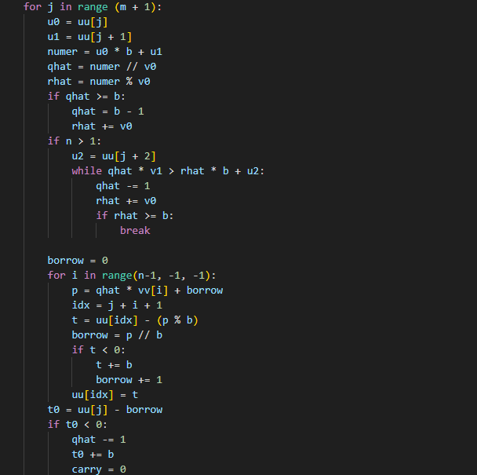
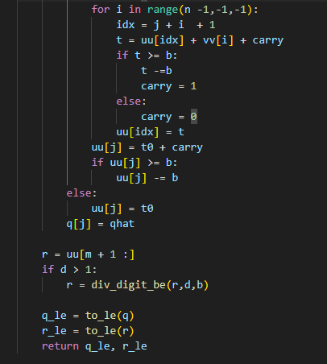
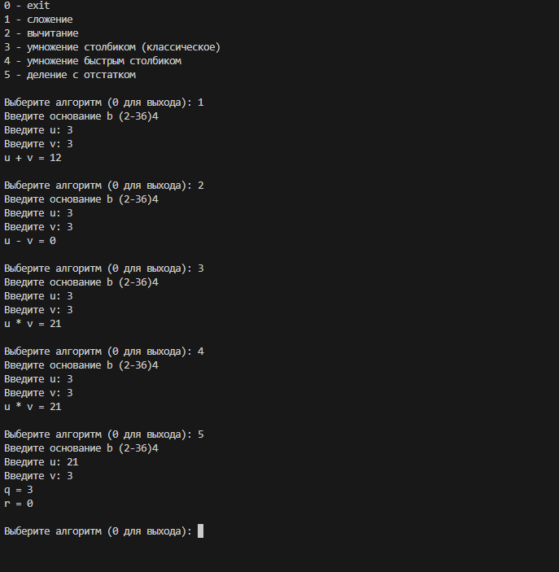

---
## Author
author:
  name: Кюнкриков Даниил Саналович
  degrees: НПИмд-01-24, 1132249574
  email: 1132249574@pfur.ru
  affiliation:
    - name: Российский университет дружбы народов (РУДН)
      country: Российская Федерация
      postal-code: 117198
      city: Москва
      address: ул. Миклухо-Маклая, д. 6

## Title
title: "Лабораторная работа №8"
subtitle: "Целочисленная арифметика многократной точности"
license: CC BY
date: today
date-format: "YYYY-MM-DD"
---

# Информация

## Докладчик

Кюнкриков Даниил Саналович

студент уч. группы НПИмд-01-24

Российский университет дружбы народов (РУДН)

1132249574@pfur.ru

репозиторий: https://github.com/DanzanK/2025-2026_math-sec/tree/main

# Вводная часть

## Актуальность

В криптографии и теории чисел часто используются числа, которые не помещаются в стандартные типы данных.

Поэтому применяют длинную арифметику: операции выполняются поразрядно (сложение, вычитание, умножение, деление) в системе счисления с основанием $b$.

## Объект и предмет исследования

**Объект исследования:** целочисленная арифметика многократной точности.

**Предмет исследования:** поразрядные алгоритмы над большими числами в основании $b$:

сложение;  

вычитание;  

умножение «столбиком»;  

«быстрый столбик» (диагональная свёртка);  

деление с остатком.

## Цели и задачи

**Цель:** реализовать целочисленные операции многократной точности в основании $b$ и проверить корректность на примерах.

**Задачи:**

выбрать представление числа как массива цифр в основании $b$;

реализовать алгоритмы 1–5;

протестировать операции и сравнить результаты.

## Материалы и методы

Язык программирования: **Python**.

Представление числа: массив цифр (little-endian), где `dig[0]` — младший разряд.

Вычисления: перенос/заём от младших разрядов к старшим; после операций выполняется нормализация (удаление ведущих нулей).

# Содержание исследования

## Представление числа

Пусть $b\ge 2$. Тогда число хранится как:

$$
u = \sum_{i=0}^{n-1} u_i b^i,\qquad 0\le u_i < b.
$$

В реализации цифры хранятся в порядке **от младшего разряда к старшему**, поэтому перенос и заём реализуются простым проходом по массиву.

## Алгоритм 1 — Сложение

На каждом разряде складываем цифры и перенос $k$:

$$
s = u_j + v_j + k,\quad w_j = s\,\text{ mod }\,b,\quad k=\left\lfloor \frac{s}{b}\right\rfloor.
$$

## Алгоритм 2 — Вычитание

Предполагаем $u\ge v$. На каждом разряде:

считаем $s=u_j-v_j-k$;

если $s<0$, то добавляем $b$ и ставим заём $k=1$.

## Алгоритм 3 — Умножение «столбиком»

Классическое умножение:

внешний цикл по разрядам второго множителя;

внутренний цикл по разрядам первого множителя;

учёт переносов и накопление частичных сумм.

## Алгоритм 4 — «Быстрый столбик» (по диагоналям)

Вместо сложения частичных произведений «по столбикам» суммируем по диагоналям (по сумме индексов $s=i+j$). 

Это даёт тот же результат, но позволяет организовать вычисления более компактно.

## Алгоритм 5 — Деление с остатком

Ищем $q$ и $r$, такие что:

$$
u = qv + r,\qquad 0\le r < v.
$$

Практически деление строится по старшим разрядам: оценивается очередная цифра частного, затем выполняется вычитание $q\cdot v$ из соответствующего окна, при необходимости оценка корректируется.

# Выполнение работы

## Алгоритм 1 — Сложение

{width=75%}

## Алгоритм 2 — Вычитание

{width=75%}

## Алгоритм 3 — Умножение «столбиком»

{width=55%}

## Алгоритм 4 — «Быстрый столбик» (по диагоналям)

{width=55%}

## Алгоритм 5 — Деление с остатком ч.1

{width=55%}

## Алгоритм 5 — Деление с остатком ч.2

:::::::::::::: {.columns}
::: {.column width="50%"}
{width=70%}
:::
::: {.column width="50%"}
{width=70%}
:::
::::::::::::::

## Результаты

Проверены операции для разных оснований (например, $b=10$ и $b=16$).

Оба алгоритма умножения дают одинаковый результат (классический и быстрый).

Для деления дополнительно проверяется равенство $u=qv+r$.

## Демонстрация

{width=45%}

# Итоговый слайд

## Выводы

Реализованы 5 базовых алгоритмов длинной арифметики в основании $b$.

Показано удобство представления чисел как массива цифр (перенос/заём обрабатываются линейным проходом).

Корректность подтверждена тестовыми примерами.

