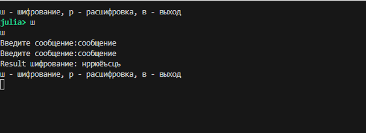

---
## Author
author:
  name: Кюнкриков Даниил Саналович
  degrees: НПИмд-01-24, 1132249574
  email: 1132249574@pfur.ru
  affiliation:
    - name: Российский университет дружбы народов (РУДН)
      country: Российская Федерация
      postal-code: 117198
      city: Москва
      address: ул. Миклухо-Маклая, д. 6

## Title
title: "Лабораторная работа №1"
subtitle: "Шифры простой замены: шифр Цезаря и шифр Атбаш"
license: CC BY
date: today
date-format: "YYYY-MM-DD"
---

# Информация

## Докладчик

Кюнкриков Даниил Саналович

студент уч. группы НПИмд-01-24

Российский университет дружбы народов (РУДН)

1132249574@pfur.ru

репозиторий: https://github.com/DanzanK/2025-2026_math-sec/tree/main

# Вводная часть

## Актуальность

Классические шифры (Цезарь, Атбаш) — базовые примеры криптографии: они помогают понять идею подстановки и обратимость шифрования.

Реализация на языке программирования позволяет на практике разобрать работу алгоритмов: обработку алфавита, ключа и символов вне алфавита.

## Объект и предмет исследования

**Объект исследования:** шифры простой замены.

**Предмет исследования:**  
Шифр Цезаря (сдвиг на ключ $k$);  

Шифр Атбаш (зеркальная подстановка);  

Реализация алгоритмов и проверка на тестовых примерах.

## Цели и задачи

**Цель:** программно реализовать шифры Цезаря и Атбаш и проверить корректность шифрования/расшифрования.

**Задачи:**
Задать русский алфавит и правила преобразования символов;

Реализовать шифрование и расшифровку для шифра Цезаря (ключ $k$);

Реализовать шифр Атбаш (самоинверсный);

Провести тестирование на примерах и проанализировать результаты.

## Материалы и методы

Язык программирования: **Julia**.

Метод: посимвольная обработка строки, работа с индексами символов алфавита.

Подход к вводу/выводу: консольное меню (шифрование/расшифровка/выход).

Представление результатов: примеры выполнения программы и сравнение исходного/зашифрованного текста.

# Содержание исследования

## Шифр Цезаря

**Идея:** каждой букве сопоставляется индекс в алфавите, затем выполняется циклический сдвиг на $k$.

Формулы (алфавит длины $n$):

шифрование: $C_i = (P_i + k)\ \text{mod}\ n$;

расшифровка: $P_i = (C_i - k)\ \text{mod}\ n$.

## Шифр Атбаш

**Идея:** выполняется «зеркальная» подстановка: буква с индексом $i$ заменяется на букву с индексом $n-1-i$.  

Шифр Атбаш **самоинверсен**, то есть шифрование и расшифровка выполняются одной и той же процедурой.

# Выполнение работы
## Шифр Цезаря
:::::::::::::: {.columns}
::: {.column width="70%"}
{width=45%}
:::
::: {.column width="50%"}
{width=95%}
:::
::::::::::::::

## Шифр Атбаш

:::::::::::::: {.columns}
::: {.column width="70%"}
{width=45%}
:::
::: {.column width="50%"}
{width=95%}
:::
::::::::::::::

## Результаты

Реализованы оба шифра с обработкой ввода через меню.

Для шифра Цезаря проверено, что при расшифровке используется обратный сдвиг ($-k$), и исходный текст восстанавливается корректно.

Для Атбаша подтверждено, что повторное применение 

преобразования возвращает исходное сообщение.

# Итоги

**Выводы:**
Реализованы шифры простой замены: Цезарь (с ключом) и Атбаш.
Получены навыки работы с алфавитами, индексами и модульной арифметикой при шифровании.
Проведено тестирование, подтверждающее корректность реализации.

