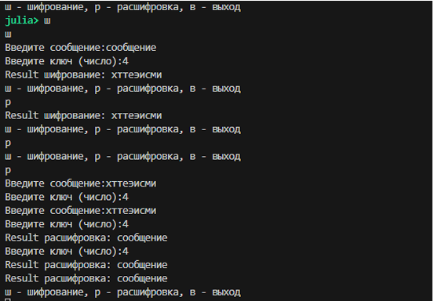

---
## Author
author:
  name: Кюнкриков Даниил Саналович
  email: 1132249574@pfur.ru
  affiliation:
    - name: Российский университет дружбы народов (РУДН)
      country: Российская Федерация
      postal-code: 117198
      city: Москва
      address: ул. Миклухо-Маклая, д. 6

## Title
title: "Лабораторная работа №1"
subtitle: "Шифры простой замены: шифр Цезаря и шифр Атбаш"
license: "CC BY"
---

# Цель работы

Изучить принципы работы шифров простой замены и реализовать на языке **Julia** два классических алгоритма:

- **шифр Цезаря** (сдвиг на ключ *k*),
- **шифр Атбаш** (зеркальная замена букв).

# Задание

1. Реализовать шифр Цезаря с произвольным целочисленным ключом *k* в режимах шифрования и расшифровки.
2. Реализовать шифр Атбаш (шифрование и расшифровка одной и той же функцией).
3. Провести проверку работы программ на тестовых примерах.

# Теоретическое введение

Классические шифры простой замены изменяют **значения** символов, оставляя их порядок неизменным. Исторические сведения и примеры таких шифров приведены в работах по истории криптографии и классическим методам кодирования [@kahn1967codebreakers; @singh1999codebook]. В современных курсах криптографии такие шифры рассматриваются как учебные примеры, позволяющие понять идею алфавитной подстановки и зависимость стойкости от размера ключевого пространства [@aumasson2017serious].

## Шифр Цезаря

Шифр Цезаря — подстановка со сдвигом: каждая буква заменяется на букву, сдвинутую на $k$ позиций по алфавиту. Пусть алфавит имеет длину $n$, а каждой букве сопоставлен индекс из диапазона $0..n-1$. Тогда:

- **шифрование:** $C_i = (P_i + k)\bmod n$;
- **расшифровка:** $P_i = (C_i - k)\bmod n$.

Здесь $P_i$ — индекс символа открытого текста, $C_i$ — индекс символа шифртекста.

## Шифр Атбаш

Атбаш — подстановка с «зеркальным» алфавитом: буква с индексом $i$ заменяется на букву с индексом $n-1-i$. В отличие от шифра Цезаря, Атбаш **самоинверсен**: операция шифрования совпадает с расшифровкой [@singh1999codebook].

# Выполнение лабораторной работы

В работе используется русский алфавит из 33 букв (включая «ё»). Символы, которые не входят в алфавит (пробелы, знаки пунктуации), копируются без изменений.

## Реализация шифра Цезаря

Алгоритм в программе:

1. Считать режим (шифрование/расшифровка).
2. Считать текст и ключ $k$.
3. Для каждой буквы найти её позицию в алфавите.
4. Пересчитать позицию по модулю $n$ и вывести соответствующий символ.

Программная реализация шифра Цезаря показана на [Листинге №1](#caesar-code).

### Листинг 1 — Шифр Цезаря {#caesar-code}
```julia
# 1) Шифр Цезаря

function main_caesar()
    # задаем алфавит для шифрования
    alphabet = collect("абвгдеёжзийклмнопрстуфхцчшщъыьэюя")
    n = length(alphabet)

    while true
        println("ш - шифрование, р - расшифровка, в - выход")
        menu = lowercase(strip(readline()))

        if menu == "в"
            break
        elseif menu == "ш"
            operation = "шифрование"
        elseif menu == "р"
            operation = "расшифровка"
        else
            println("Ошибка команды")
            continue
        end

        print("Введите сообщение: ")
        message = lowercase(strip(readline()))

        print("Введите ключ (число): ")
        key = try
            parse(Int, readline())
        catch
            println("Ошибка: ключ должен быть целым числом")
            continue
        end

        # При расшифровке используем обратный сдвиг
        if menu == "р"
            key = -key
        end

        output = ""
        for letter in message
            idx = findfirst(isequal(letter), alphabet)
            if idx !== nothing
                new_idx = mod(idx + key - 1, n) + 1
                output *= string(alphabet[new_idx])
            else
                output *= string(letter)
            end
        end

        println("Result $operation: $output")
    end
end

# main_caesar()
```

## Реализация шифра Атбаш

Алгоритм:

1. Для каждой буквы ищется её индекс в алфавите.
2. Индекс зеркальной буквы вычисляется как $n - idx + 1$ (учёт 1-индексации Julia).
3. Результат записывается в буфер (IOBuffer), чтобы избежать многократной конкатенации строк.

Программная реализация шифра Атбаш показана на [Листинге №2](#atbash-code).

### Листинг 2 — Шифр Атбаш {#atbash-code}

```julia
# 2) Шифр Атбаш

function atbash(message::AbstractString, alphabet::Vector{Char})
    n = length(alphabet)
    output = IOBuffer()

    for letter in message
        idx = findfirst(==(letter), alphabet)
        if idx !== nothing
            new_idx = n - idx + 1
            write(output, alphabet[new_idx])
        else
            write(output, letter)
        end
    end

    return String(take!(output))
end

function main_atbash()
    alphabet = collect("абвгдеёжзийклмнопрстуфхцчшщъыьэюя")

    while true
        println("ш - шифрование, р - расшифровка, в - выход")
        menu = lowercase(strip(readline()))

        if menu == "в"
            break
        elseif menu in ["ш", "р"]
            operation = menu == "ш" ? "шифрование" : "расшифровка"
        else
            println("Ошибка команды")
            continue
        end

        print("Введите сообщение: ")
        message = lowercase(strip(readline()))

        output = atbash(message, alphabet)
        println("Result $operation: $output")
    end
end

# main_atbash()
```

## Результаты работы

### Шифр Цезаря
Результат программной реализации шифра Цезаря представлен на рисунке @fig-1

{#fig-1 width=90%}

### Шифр Атбаш
Результат программной реализации шифра Атбаш представлен на рисунке @fig-2 

{#fig-2 width=90%}

# Выводы

1. Реализованы два шифра простой замены: Цезарь (сдвиг по модулю алфавита) и Атбаш (зеркальная подстановка).
2. Освоены практические приёмы работы со строками и символами в Julia: поиск в алфавите, модульные вычисления, обработка ввода.
3. Проведено тестирование, подтверждающее корректность шифрования и расшифровки.

# Список литературы{.unnumbered}

::: {#refs}
:::
