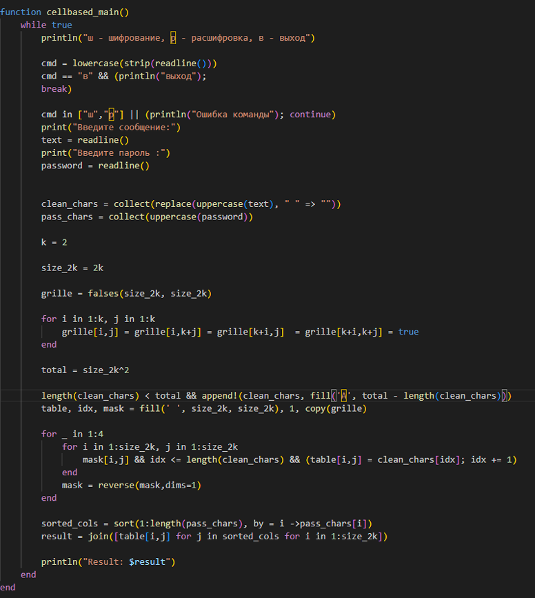
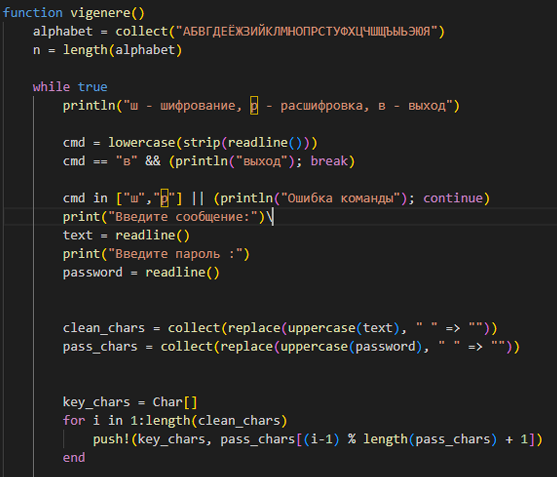
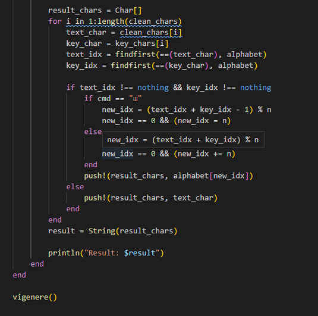
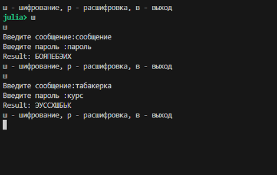

---
## Author
author:
  name: Кюнкриков Даниил Саналович
  degrees: НПИмд-01-24, 1132249574
  email: 1132249574@pfur.ru
  affiliation:
    - name: Российский университет дружбы народов (РУДН)
      country: Российская Федерация
      postal-code: 117198
      city: Москва
      address: ул. Миклухо-Маклая, д. 6

## Title
title: "Лабораторная работа №2"
subtitle: "Шифры перестановки: маршрутное шифрование, решётка, таблица Виженера"
license: CC BY
date: today
date-format: "YYYY-MM-DD"
---

# Информация

## Докладчик

Кюнкриков Даниил Саналович

студент уч. группы НПИмд-01-24

Российский университет дружбы народов (РУДН)

1132249574@pfur.ru

репозиторий: https://github.com/DanzanK/2025-2026_math-sec/tree/main

# Вводная часть

## Актуальность

Шифры перестановки — базовый класс классической криптографии: они показывают, как изменение **порядка** символов влияет на читаемость и стойкость.

Практическая реализация помогает понять: табличное представление текста, перестановку по ключу и восстановление исходного сообщения.

## Объект и предмет исследования

**Объект исследования:** шифры перестановки.

**Предмет исследования:**

Маршрутное шифрование по ключевому слову;

Шифрование с помощью решёток (таблица 4×4);

Таблица Виженера;

Программная реализация и тестирование.

## Цели и задачи

**Цель:** реализовать алгоритмы, предусмотренные лабораторной работой №2, и проверить их работу на примерах.

**Задачи:**

Реализовать режимы шифрования/расшифровки через меню;

Реализовать маршрутное шифрование, решётку и Виженера;

Протестировать алгоритмы на контрольных примерах и оформить результаты.

## Материалы и методы

Язык программирования: **Julia**.

Методы: табличное представление текста, перестановка столбцов по ключу, маска (решётка), модульная арифметика по алфавиту.

Формат демонстрации: фрагменты кода и примеры результата работы программы.

# Содержание исследования

## Маршрутное шифрование

**Идея:** текст записывается в таблицу *m×n*, где *n* — длина ключевого слова, затем столбцы упорядочиваются по алфавиту букв ключа и таблица считывается по столбцам.

**Шаги:**
Удалить пробелы, привести к верхнему регистру, дополнить до *m·n*.

Заполнить таблицу.

Отсортировать столбцы по ключу (получить перестановку).

Считать по столбцам → шифртекст.

## Шифрование с помощью решёток

**Идея:** таблица заполняется через “прорези” (маску). После преобразования маски (в классическом варианте — поворот на $90^\circ$) открываются новые позиции, и запись продолжается, пока не будет заполнена вся таблица.

В реализации используется таблица **4×4** (то есть $2k\times 2k$ при $k=2$).

## Таблица Виженера

Виженер — полиалфавитный метод: ключ повторяется циклически, и каждый символ сообщения сдвигается на величину, соответствующую символу ключа.

Формулы (для алфавита длины $n$):

шифрование: $C_i = (P_i + K_i)\,\text{ mod }\,n$

расшифровка: $P_i = (C_i - K_i)\,\text{ mod }\,n$

# Выполнение работы

## Маршрутное шифрование — реализация и пример

:::::::::::::: {.columns}
::: {.column width="50%"}
{width=100%}
:::
::: {.column width="50%"}
{width=100%}
:::
::::::::::::::

## Решётка — реализация и пример (4×4)

:::::::::::::: {.columns}
::: {.column width="50%"}
{width=80%}
:::
::: {.column width="50%"}
{width=100%}
:::
::::::::::::::

## Виженер — реализация и результат

:::::::::::::: {.columns}
::: {.column width="50%"}
{width=100%}
:::
::: {.column width="50%"}
{width=80%}
:::
::::::::::::::

## Результаты

{width=70%}

Реализованы три алгоритма: маршрутное шифрование, решётка и таблица Виженера.

Выполнены тестовые прогоны и получены корректные результаты шифрования.

Реализация оформлена в виде меню, что позволяет быстро проверять разные тексты и ключи.

# Итоги

**Выводы:**
Изучены и реализованы табличные методы перестановки и полиалфавитный метод Виженера.

На практике отработаны: подготовка текста, перестановка по ключу и преобразование по алфавиту.

Проведено тестирование, подтверждающее корректность работы программ.

