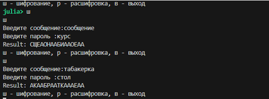

---
## Author
author:
  name: Кюнкриков Даниил Саналович
  degrees: студент НПИмд-01-24, 1132249574
  email: 1132249574@pfur.ru
  affiliation:
    - name: Российский университет дружбы народов (РУДН)
      country: Российская Федерация
      postal-code: 117198
      city: Москва
      address: ул. Академика-Волгина, д. 8, к. 1

## Title
title: "Лабораторная работа №2"
subtitle: 'Шифры перестановки: маршрутное шифрование, шифрование с помощью решёток, таблица Виженера'
license: "CC BY"
---


# Цель работы

Изучить принципы работы шифров перестановки и реализовать на языке **Julia** три алгоритма:

- маршрутное (колоночное) шифрование по ключевому слову;
- шифрование с помощью решёток (решётка 4×4);
- шифрование по таблице Виженера.

# Задание

1. Реализовать указанные алгоритмы в режимах шифрования и расшифровки (через меню программы).
2. Провести проверку работы программ на тестовых сообщениях и ключах.
3. Оформить отчёт о проделанной работе.

# Теоретическое введение

Шифры перестановки изменяют **порядок** символов открытого текста без замены самих символов. Такие методы относятся к классической криптографии и часто рассматриваются в историческом контексте вместе с простыми подстановками [@singh1999codebook]. Несмотря на простоту, табличные перестановки удобно использовать для объяснения ключевых идей: представление текста в матрице, применение перестановки по ключу и восстановление исходного порядка.

## Маршрутное (колоночное) шифрование

Текст записывается в таблицу $m\times n$, где $n$ — длина ключевого слова. Далее столбцы упорядочиваются по алфавиту букв ключа (формируется перестановка столбцов), и таблица считывается по столбцам в новом порядке. Для расшифрования требуется построить обратную перестановку и восстановить исходное размещение символов.

## Шифрование с помощью решёток (решётка Кардано)

Решётка Кардано — это трафарет (маска) с «прорезями», через которые последовательно записываются буквы текста. После поворотов (обычно на $90^\circ$) маска открывает новые позиции, пока не будет заполнена вся таблица [@singh1999codebook]. Ключом служит расположение прорезей (и порядок поворотов).

## Таблица Виженера

Шифр Виженера относится к полиалфавитным подстановкам: сдвиг определяется символом ключа, который повторяется до длины сообщения. В терминах индексов алфавита длины $n$:

- **шифрование:** $C_i = (P_i + K_i)\bmod n$;
- **расшифровка:** $P_i = (C_i - K_i)\bmod n$,

где $K_i$ — индекс $i$‑го символа повторяющегося ключа [@menezes1996hac; @singh1999codebook].

# Выполнение лабораторной работы

Ниже приведены листинги программных реализаций (Julia).

## Маршрутное шифрование

Программная реализация маршрутного шифрования показана на [Листинге №1](#route).

### Листинг №1 — Маршрутное шифрование (колоночная перестановка) {#route}

```julia
function marshr_main()
    # Бесконечный цикл для работы программы до команды выхода

    while true
        # Выводим меню с доступными командами
        println("ш - шифрование, р - расшифровка, в - выход")
        #menu = lowercase(strip(readline()))
        cmd = lowercase(strip(readline()))
        cmd == "в" && (println("выход");
        break)
        cmd in ["ш","р"] || (println("Ошибка команды"); continue)
        # Запрашиваем текст для шифрования/расшифрования и пароля шифра
        print("Введите сообщение:")
        text = readline()
        print("Введите пароль :")
        password = readline()

        # подготовка текста
        # удаление пробелов и приводим к верхнему регистру
        clean_text = replace(uppercase(text), " " => "")
        # преобразуем пароль в массив символов (для избежания проблем с индексацией русских символов)
        pass_chars = collect(uppercase(password))
        # n - количество столбцов (равно длине пароля)
        # m - количество строк
        n, m = length(pass_chars), ceil(Int, length(clean_text) / length(pass_chars))

        padded = clean_text * "А"^(m*n - length(clean_text))
        table = reshape(collect(padded), (m, n))
        # создание таблицы
        column_pairs = [(pass_chars[i], i) for i in 1:length(pass_chars)]
        # Сортируем пары по символам пароля (алфавитный порядок)
        sort!(column_pairs, by = x -> x[1])
        sorted_cols = [idx for (char, idx) in column_pairs]
        result = join([table[i,j] for j in sorted_cols for i in 1:m])
        # вывод результата
        println("Result: $result")
    end
end

marshr_main()
```

## Шифрование с помощью решёток

Программная реализация шифрования с помощью решёток показана на [Листинге №2](#grille).

### Листинг №2 — Шифрование с помощью решёток {#grille}

```julia
function cellbased_main()
    while true
        println("ш - шифрование, р - расшифровка, в - выход")
        
        cmd = lowercase(strip(readline()))
        cmd == "в" && (println("выход");
        break)

        cmd in ["ш","р"] || (println("Ошибка команды"); continue)
        print("Введите сообщение:")
        # Запрашиваем текст для шифрования/расшифрования и пароля шифра
        
        text = readline()
        # должен содержать 4 символа для решетки 2x2
        print("Введите пароль (4 символа):")
        password = readline()


        clean_chars = collect(replace(uppercase(text), " " => ""))
        pass_chars = collect(uppercase(password))

        k = 2 # размер решетки
        # Размер большой решетки (2k × 2k = 4x4)
        size_2k = 2*k
        # Создаем булеву маску (false - закрыто, true - прорезь)
        grille = falses(size_2k, size_2k)
        # Заполняем маску прорезями в 4 угловых квадратах 2x2
        for i in 1:k, j in 1:k
            grille[i,j] = grille[i,k+j] = grille[k+i,j]  = grille[k+i,k+j] = true
        end

        total = size_2k^2

        length(clean_chars) < total && append!(clean_chars, fill('А', total - length(clean_chars)))
        table, idx, mask = fill(' ', size_2k, size_2k), 1, copy(grille)

        for _ in 1:4
            for i in 1:size_2k, j in 1:size_2k
                mask[i,j] && idx <= length(clean_chars) && (table[i,j] = clean_chars[idx]; idx += 1)
            end
            mask = reverse(mask,dims=1)
        end

        sorted_cols = sort(1:length(pass_chars), by = i ->pass_chars[i])
        result = join([table[i,j] for j in sorted_cols for i in 1:size_2k])

        println("Result: $result")
    end
end

cellbased_main()
```

## Таблица Виженера

Программная реализация таблицы Виженера показана на [Листинге №3](#vigenere).

### Листинг №3 — Таблица Виженера {#vigenere}

```julia
function vigenere()
    alphabet = collect("АБВГДЕЁЖЗИЙКЛМНОПРСТУФХЦЧШЩЪЫЬЭЮЯ")
    n = length(alphabet)

    while true
        println("ш - шифрование, р - расшифровка, в - выход")
        
        cmd = lowercase(strip(readline()))
        cmd == "в" && (println("выход"); break)

        cmd in ["ш","р"] || (println("Ошибка команды"); continue)
        print("Введите сообщение:")
        text = readline()
        print("Введите пароль :")
        password = readline()


        clean_chars = collect(replace(uppercase(text), " " => ""))
        pass_chars = collect(replace(uppercase(password), " " => ""))

        # Создаем пустой массив символов для ключа
        key_chars = Char[]
        # Для каждого символа текста определяем соответствующий символ ключа
        for i in 1:length(clean_chars)
            push!(key_chars, pass_chars[(i-1) % length(pass_chars) + 1])
        end

        result_chars = Char[]
        # Обрабатываем каждый символ текста
        for i in 1:length(clean_chars)
            text_char = clean_chars[i]
            key_char = key_chars[i]
            # Находим позиции символов в алфавите
            text_idx = findfirst(==(text_char), alphabet)
            key_idx = findfirst(==(key_char), alphabet)

            if text_idx !== nothing && key_idx !== nothing
                if cmd == "ш"
                    new_idx = (text_idx + key_idx - 1) % n
                    new_idx == 0 && (new_idx = n)
                else
                    new_idx = (text_idx - key_idx) % n
                    new_idx == 0 && (new_idx = n)
                end
                # Добавляем преобразованный символ к результату
                push!(result_chars, alphabet[new_idx])
            else
                push!(result_chars, text_char)
            end
        end
        result = String(result_chars)
       
        println("Result: $result")
    end
end

vigenere()
```

# Результаты работы

В качестве проверки были выполнены тестовые прогоны алгоритмов (пример ввода/вывода).

## Маршрутное шифрование — пример

Результат программной реализации маршрутного шифрования представлен на рисунке @fig-1.

{#fig-1 width=90%}

## Решётка 4×4 — пример

Результат программной реализации шифрования с помощью решёток представлен на рисунке @fig-2.

{#fig-2 width=90%}

## Виженер — пример

Результат программной реализации таблицы Виженера представлен на рисунке @fig-3.

{#fig-3 width=90%}

# Выводы

1. Реализованы три криптографических алгоритма: маршрутное шифрование, шифрование с помощью решёток и таблица Виженера.
2. Реализован консольный интерфейс с выбором режима (шифрование/расшифровка) и вводом ключа.
3. Выполнено тестирование на примерах, подтверждающее работоспособность реализованных программ.

