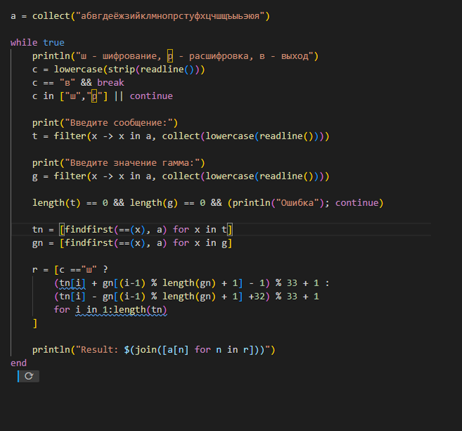

---
## Author
author:
  name: Кюнкриков Даниил Саналович
  degrees: НПИмд-01-24, 1132249574
  email: 1132249574@pfur.ru
  affiliation:
    - name: Российский университет дружбы народов (РУДН)
      country: Российская Федерация
      postal-code: 117198
      city: Москва
      address: ул. Миклухо-Маклая, д. 6

## Title
title: "Лабораторная работа №3"
subtitle: "Шифрование гаммированием"
license: CC BY
date: today
date-format: "YYYY-MM-DD"
---

# Информация

## Докладчик

Кюнкриков Даниил Саналович

студент уч. группы НПИмд-01-24

Российский университет дружбы народов (РУДН)

1132249574@pfur.ru

Репозиторий: https://github.com/DanzanK/2025-2026_math-sec/tree/main

# Вводная часть

## Актуальность

Гаммирование — базовый принцип **потокового шифрования**: каждый символ сообщения преобразуется с использованием ключевой последовательности (гаммы).

На практике это помогает понять: как формируется ключевой поток, как работает циклическое повторение ключа и почему операции шифрования/расшифровки являются обратными.

## Объект и предмет исследования

**Объект исследования:** методы гаммирования (потоковое шифрование на уровне алфавита).

**Предмет исследования:**  
Конечная гамма (ключевая строка) и её циклическое применение; 

Модульная арифметика по размеру алфавита;  

Программная реализация шифрования и расшифровки.

## Цели и задачи

**Цель:** реализовать шифрование гаммированием с конечной гаммой и проверить корректность.

**Задачи:**
Реализовать режимы шифрования и расшифровки;

Реализовать циклическое применение гаммы по длине сообщения;

Выполнить тестирование и оформить результаты.

## Материалы и методы

Язык программирования: **Julia**.

Метод: посимвольная обработка строки и перевод букв в индексы алфавита.

Вычисления: сложение/вычитание по модулю $n$ (длина алфавита).

Демонстрация: фрагменты реализации и пример результата работы программы.

# Содержание исследования

## Теоретические основы

**Гамма** — ключевой поток (последовательность символов/кодов), который применяется к тексту посимвольно. 

Если длина гаммы меньше длины текста, она повторяется циклически до нужной длины.

## Формулы (алфавит длины $n$)

Пусть $P_i$ — индекс символа открытого текста, $K_i$ — индекс символа гаммы, $C_i$ — индекс шифртекста. Тогда:

шифрование: $C_i = (P_i + K_i)\,\text{ mod }\,n$

расшифровка: $P_i = (C_i - K_i)\,\text{ mod }\,n$

## Алгоритм (шаги)

Привести текст и гамму к алфавиту (в реализации — фильтрация по алфавиту).

Преобразовать символы в индексы алфавита.

Для каждой позиции применить символ гаммы (циклически).

Выполнить сложение/вычитание по модулю $n$.

Преобразовать индексы обратно в символы и вывести результат.

# Выполнение работы

## Реализация (Julia)

{width=70%}

## Результат работы программы

{width=80%}

## Результаты

Реализован алгоритм шифрования гаммированием с конечной гаммой.

Реализованы режимы шифрования/расшифровки и циклическое применение гаммы.

Проведён тестовый запуск программы на примере.

# Итоги

**Выводы:**
Изучен принцип гаммирования как базового метода поточного шифрования.

Реализованы преобразования символов через индексы алфавита и модульную арифметику.

Подтверждена обратимость шифрования и расшифровки на тестовых данных.

