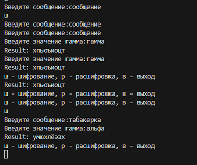

---
## Author
author:
  name: Кюнкриков Даниил Саналович
  degrees: студент НПИмд-01-24, 1132249574
  email: 1132249574@pfur.ru
  affiliation:
    - name: Российский университет дружбы народов (РУДН)
      country: Российская Федерация
      postal-code: 117198
      city: Москва
      address: ул. Миклухо-Маклая, д. 6

## Title
title: "Лабораторная работа №3"
subtitle: "Шифрование гаммированием с конечной гаммой"
license: "CC BY"
---

# Цель работы

**Цель:** реализовать алгоритм шифрования гаммированием с конечной гаммой на языке Julia.

**Задачи:**

1. Реализовать режимы шифрования и расшифровки.
2. Реализовать циклическое применение гаммы (если гамма короче текста).
3. Проверить работу программы на тестовом примере.

# Задание

- Реализовать алгоритм согласно методическим указаниям.
- Провести проверку на тестовых данных.
- Проанализировать результаты.

# Теоретическое введение

Шифрование гаммированием относится к методам, где открытый текст комбинируется с **ключевым потоком** (гаммой). В современных терминах это близко к поточным шифрам: для каждого символа сообщения используется свой элемент гаммы, а расшифрование выполняется обратной операцией [@katz2020imc; @menezes1996hac].

## Понятие гаммы

**Гамма** $G=(g_1,g_2,\dots)$ — последовательность элементов (символов или чисел), используемая для преобразования текста. В лабораторной работе применяется конечная гамма (ключевая строка), которая циклически повторяется до длины сообщения:
$$
g_i = G_{((i-1)\bmod \ell)+1},
$$
где $\ell$ — длина заданной гаммы.

## Формулы гаммирования

Пусть алфавит имеет длину $n$, а символы текста и гаммы представлены индексами $P_i$ и $K_i$ в диапазоне $0..n-1$. Тогда:

- **шифрование:** $C_i = (P_i + K_i)\bmod n$;
- **расшифровка:** $P_i = (C_i - K_i)\bmod n$.

Если гамма является истинно случайной и используется один раз (one-time pad), то достигается максимальная стойкость; при повторяющейся гамме появляются статистические уязвимости, аналогичные шифру Виженера [@aumasson2017serious; @katz2020imc].

# Выполнение лабораторной работы

Ниже приведён листинг программной реализации (Julia). 
В программе используется алфавит из 33 русских букв. 
Символы, не входящие в алфавит, в данной реализации отбрасываются.

Показано в [Листинге №1](#gamma).


### Листинг 1 — Шифрование гаммированием (конечная гамма){#gamma}

```julia

## Результаты

Результат запуска программы изображен на @fig-1.


{#fig-1 width=90%}

# Выводы

1. Реализован алгоритм шифрования гаммированием с конечной гаммой.
2. Реализованы режимы шифрования и расшифровки с циклическим применением гаммы.
3. Проведён тестовый запуск, подтверждающий работоспособность реализации.

# Список литературы{.unnumbered}

::: {#refs}
:::
