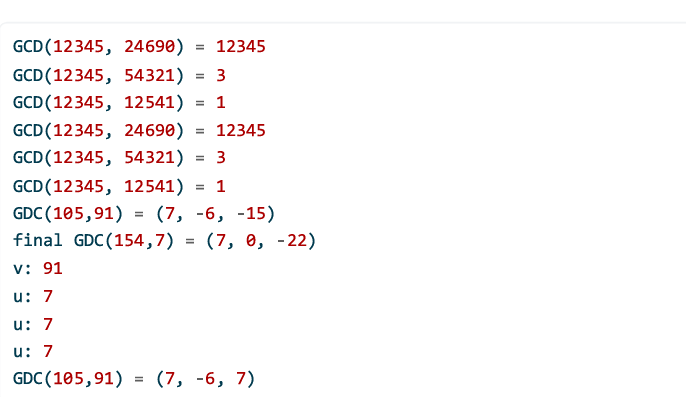

---
## Author
author:
  name: Кюнкриков Даниил Саналович
  degrees: НПИмд-01-24, 1132249574
  email: 1132249574@pfur.ru
  affiliation:
    - name: Российский университет дружбы народов (РУДН)
      country: Российская Федерация
      postal-code: 117198
      city: Москва
      address: ул. Миклухо-Маклая, д. 6

## Title
title: "Лабораторная работа №4"
subtitle: "Алгоритмы Евклида: НОД и коэффициенты Безу"
license: CC BY
date: today
date-format: "YYYY-MM-DD"
---

# Информация

## Докладчик

Кюнкриков Даниил Саналович

студент уч. группы НПИмд-01-24

Российский университет дружбы народов (РУДН)

1132249574@pfur.ru

репозиторий: https://github.com/DanzanK/2025-2026_math-sec/tree/main

# Вводная часть

## Актуальность

Вычисление $\gcd(a,b)$ — базовая операция в теории чисел и криптографии (обратные элементы по модулю, сравнения, ключевые алгоритмы).

Расширенные алгоритмы Евклида позволяют находить коэффициенты Безу $x$ и $y$ из равенства $ax + by = d$, что напрямую используется в задачах модульной арифметики.

## Объект и предмет исследования

**Объект исследования:** алгоритмы вычисления наибольшего общего делителя.

**Предмет исследования:**
классический алгоритм Евклида;

бинарный алгоритм Евклида (Стейна);

расширенный алгоритм Евклида (коэффициенты Безу);

расширенный бинарный алгоритм Евклида;

программная реализация и проверка корректности.

## Цели и задачи

**Цель:** реализовать алгоритмы вычисления НОД и (для расширенных версий) коэффициенты Безу.

**Задачи:**
реализовать классический алгоритм Евклида;

реализовать бинарный алгоритм Евклида (Стейна);

реализовать расширенный Евклид (возврат $d, x, y$);

реализовать расширенный бинарный Евклид и проверить инварианты;
сравнить результаты с `math.gcd` и проверить равенство $ax+by=d$.

## Материалы и методы

Язык программирования: **Python**.
Методы: деление с остатком (классический Евклид), операции чётности/деление на 2 и вычитание (бинарный Евклид).

Проверка: сравнение $\gcd$ с `math.gcd`, а для расширенных алгоритмов — подстановка коэффициентов в $ax+by$.

# Содержание исследования

## Теория: ключевые формулы

Если $a = qb + r$, то $\gcd(a,b)=\gcd(b,r)$.

Тождество Безу: существуют $x,y$, что $ax + by = \gcd(a,b)$.

## Алгоритм Евклида

Итеративно выполняем:

$r \leftarrow a\,\text{ mod }\,b$,

$(a,b) \leftarrow (b,r)$,  

пока $b \ne 0$. Ответ — последний ненулевой остаток.

## Бинарный Евклид (Стейн)

Используем свойства:

если оба чётные: выносим множитель 2;

если одно чётное: делим его на 2;

если оба нечётные: заменяем большее на разность $|a-b|$.

## Расширенные алгоритмы

**Расширенный Евклид** ведёт коэффициенты $x,y$ вместе с остатками и возвращает $(d,x,y)$, где $ax+by=d$.

**Расширенный бинарный** поддерживает инварианты:

 $u = A a + B b$,

  $v = C a + D b$,
и обновляет коэффициенты при делении на 2 и вычитаниях.

# Выполнение работы

## Реализация: алгоритм Евклида (Python)

{width=75%}

## Реализация: бинарный алгоритм Евклида (Python)

{width=60%}

## Реализация: расширенный алгоритм Евклида (Python)

Возвращаем $(d,x,y)$, где $ax+by=d$.

{width=50%}

## Реализация: расширенный бинарный Евклид (Python)

:::::::::::::: {.columns}
::: {.column width="50%"}
{width=80%}
:::
::: {.column width="50%"}
{width=100%}
:::
::::::::::::::

# Результаты

## Результат работы программы

Для пар $(12345,24690)$, $(12345,54321)$, $(12345,12541)$ значения НОД во всех реализациях совпадают с `math.gcd`.
Для $(105,91)$ проверено равенство $105x + 91y = d$ для расширенных алгоритмов.

{width=60%}

# Итоговый слайд

## Выводы

Реализованы 4 алгоритма вычисления НОД: классический, бинарный, расширенный и расширенный бинарный.

Для расширенных алгоритмов получены корректные коэффициенты Безу.

Корректность подтверждена сравнением с `math.gcd` и проверкой равенства $ax+by=d$.

