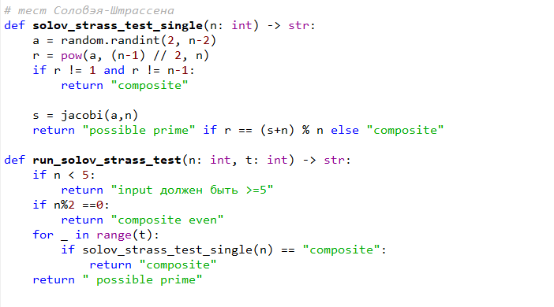

---
## Author
author:
  name: Кюнкриков Даниил Саналович
  degrees: НПИмд-01-24, 1132249574
  email: 1132249574@pfur.ru
  affiliation:
    - name: Российский университет дружбы народов (РУДН)
      country: Российская Федерация
      postal-code: 117198
      city: Москва
      address: ул. Миклухо-Маклая, д. 6

## Title
title: "Лабораторная работа №5"
subtitle: "Вероятностные тесты простоты: Ферма, Соловэй–Штрассен, Миллер–Рабин"
license: CC BY
date: today
date-format: "YYYY-MM-DD"
---

# Информация

## Докладчик

Кюнкриков Даниил Саналович

студент уч. группы НПИмд-01-24

Российский университет дружбы народов (РУДН)

1132249574@pfur.ru

репозиторий: https://github.com/DanzanK/2025-2026_math-sec/tree/main

# Вводная часть

## Актуальность

Проверка чисел на простоту — базовая задача криптографии (генерация ключей, параметры протоколов).

Для больших $n$ используются быстрые **вероятностные** тесты, которые либо находят свидетеля составности, либо дают вывод «вероятно простое» с контролируемой ошибкой.

## Объект и предмет исследования

**Объект исследования:** алгоритмы проверки чисел на простоту.

**Предмет исследования:**
тест Ферма;

символ Якоби и тест Соловэя–Штрассена;

тест Миллера–Рабина;

программная реализация и демонстрация на примерах.

## Цели и задачи

**Цель:** реализовать вероятностные алгоритмы проверки чисел на простоту на Python.

**Задачи:**
реализовать тест Ферма;

реализовать вычисление символа Якоби;

реализовать тест Соловэя–Штрассена;

реализовать тест Миллера–Рабина;

провести тестирование и представить результаты.

## Материалы и методы

Язык программирования: **Python**.

Методика: многократные проверки для случайных оснований $a$ (раунды), количество раундов — параметр $t$.

Вывод: «составное» при нахождении свидетеля, иначе — «вероятно простое».

# Содержание исследования

## Общая схема вероятностных тестов

Параметры:

$n$ — проверяемое число,

$t$ — число раундов,

$a$ — случайное основание (свидетель).

На каждом раунде выбирается $a$ и проверяется критерий; нарушение критерия означает, что $n$ **точно составное**.

## Тест Ферма

Для простого $n$ (и $\gcd(a,n)=1$) выполняется:

$$
a^{n-1} \equiv 1 \pmod n.
$$

Если равенство нарушено, найден свидетель составности.

# Выполнение работы

## Реализация: тест Ферма

{width=70%}

## Символ Якоби и тест Соловэя–Штрассена

Символ Якоби $(a/n)\in\{-1,0,1\}$ вычисляется по правилам вынесения степеней 2 и квадратичной взаимности.  

Критерий Эйлера для простого $n$:

$$
a^{(n-1)/2} \equiv (a/n) \pmod n.
$$

Оценка ошибки для составного $n$: не более $2^{-t}$.

## Реализация: Якоби и Соловэй–Штрассен

:::::::::::::: {.columns}
::: {.column width="50%"}
{width=100%}
:::
::: {.column width="50%"}
{width=100%}
:::
::::::::::::::

## Тест Миллера–Рабина

Представим:

$$
n-1 = 2^s\cdot d,\quad d\ \text{нечётное}.
$$

Вычисляем $y_0=a^d\bmod n$ и далее цепочку квадратов $y_{k+1}=y_k^2\bmod n$. 

Если ни разу не получено значение $-1\bmod n$, то найден свидетель составности. Оценка ошибки: не более $4^{-t}$.

## Реализация: Миллер–Рабин

{width=45%}

## Результаты

{width=80%}

# Итоговый слайд

## Выводы

Реализованы вероятностные тесты простоты: Ферма, Соловэй–Штрассен, Миллер–Рабин.

Реализовано вычисление символа Якоби.

Выполнена демонстрация работы программы; получены результаты для различных $n$ и параметра $t$.

