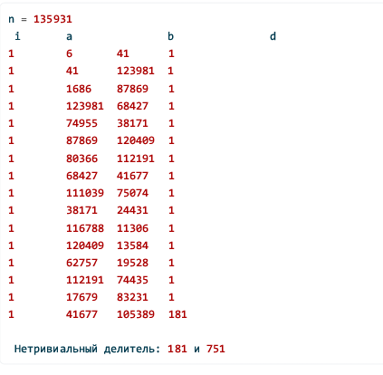

---
## Author
author:
  name: Кюнкриков Даниил Саналович
  degrees: студент НПИмд-01-24, 1132249574
  email: 1132249574@pfur.ru
  affiliation:
    - name: Российский университет дружбы народов (РУДН)
      country: Российская Федерация
      postal-code: 117198
      city: Москва
      address: ул. Миклухо-Маклая, д. 6

## Title
title: "Лабораторная работа №6"
subtitle: "Разложение чисел на множители: ρ-метод Полларда"
license: "CC BY"
---
# Цель работы

Цель работы - Изучить принципы работы ρ-метода Полларда для факторизации и реализовать алгоритм на языке Python.

# Задание

1. Реализовать ρ-метод Полларда для поиска нетривиального делителя составного числа $n$.
2. Продемонстрировать работу алгоритма на тестовом примере и получить разложение $n = p\cdot q$.


# Теоретическое введение

Задача факторизации — разложение составного числа $n$ на множители — лежит в основе оценки стойкости криптосистем, например RSA. Для чисел среднего размера применяются вероятностные алгоритмы, один из наиболее известных — $\rho$‑метод Полларда [@pollard1975factor; @crandall2005prime].

## Идея $\rho$‑метода Полларда

Выбирается отображение $f(x)=x^2+c \pmod n$ и строится последовательность $x_{i+1}=f(x_i)$. Поскольку множество вычетов конечно, последовательность рано или поздно образует цикл (граф напоминает букву $\rho$). Для ускорения поиска коллизии применяется схема Флойда «черепаха–заяц»:
- $a\leftarrow f(a)$,
- $b\leftarrow f(f(b))$.

На каждом шаге вычисляется:
$$
d=\gcd(|a-b|,n).
$$
Если $1<d<n$, то найден нетривиальный делитель $d$; если $d=n$, алгоритм перезапускают с другими параметрами [@pollard1975factor; @brent1980improved].

## Практические замечания

Метод эффективен для поиска сравнительно небольших делителей и часто применяется как подалгоритм в более сложных схемах факторизации [@wagstaff2013joy; @crandall2005prime].

# Выполнение лабораторной работы

Программная реализация ρ-метода Полларда показана на [Листинге №1](#pollard).

### Листинг 1 — ρ-метод Полларда (Python) {#pollard}

```python
import math


def pollard_rho_factor(n: int, c: int = 5, x0: int = 1) -> int | None:
    #Возвращает нетривиальный делитель n или None, если попытка неудачна

    if n % 2 == 0:
        return 2

    def f(x: int) -> int:
        return (x * x + c) % n

    a = x0
    b = x0

    # Табличный вывод : номер шага, a, b, d
    print(" i\t a\t\t b\t\t d")

    i = 0
    while True:
        i += 1
        a = f(a)          # "черепаха"
        b = f(f(b))       # "заяц"
        d = math.gcd(abs(a - b), n)

        print(f"{i}\t {a}\t {b}\t {d}")

        if 1 < d < n:
            return d
        if d == n:
            return None


if __name__ == "__main__":
    n = int(input("n = ").strip())
    d = pollard_rho_factor(n)

    if d is None:
        print("\nПопытка найти делитель провалилась (d = n).")
    else:
        print(f"\nНетривиальный делитель: {d} и {n // d}")
```

Результат работы программы для $n=1359331$ показан на  @fig-1.

{#fig-1 width=90%}
# Выводы

1. Реализован ρ-метод Полларда для поиска нетривиального делителя составного числа.
2. Продемонстрирована работа алгоритма на тестовом примере: получено разложение $1359331 = 1181\cdot1151$.


# Список литературы{.unnumbered}

::: {#refs}
:::
