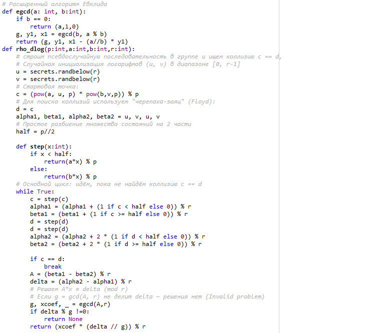
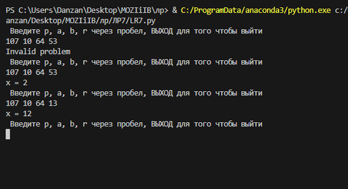

---
## Author
author:
  name: Кюнкриков Даниил Саналович
  degrees: НПИмд-01-24, 1132249574
  email: 1132249574@pfur.ru
  affiliation:
    - name: Российский университет дружбы народов (РУДН)
      country: Российская Федерация
      postal-code: 117198
      city: Москва
      address: ул. Миклухо-Маклая, д. 6

## Title
title: "Лабораторная работа №7"
subtitle: "Дискретное логарифмирование в конечном поле: ρ-метод Полларда"
license: CC BY
date: today
date-format: "YYYY-MM-DD"
---

# Информация

## Докладчик

Кюнкриков Даниил Саналович

студент уч. группы НПИмд-01-24

Российский университет дружбы народов (РУДН)

1132249574@pfur.ru

репозиторий: https://github.com/DanzanK/2025-2026_math-sec/tree/main

# Вводная часть

## Актуальность

Задача дискретного логарифмирования (DLP) — фундаментальная проблема криптографии; на её сложности основаны схемы Диффи–Хеллмана и Эль‑Гамаля.

Изучение алгоритмов решения DLP важно для оценки стойкости криптосистем и выбора безопасных параметров групп.

## Объект и предмет исследования

**Объект исследования:** алгоритмы дискретного логарифмирования в конечном поле.

**Предмет исследования:**
задача $a^x \equiv b\pmod p$ в группе $\mathbb{F}_p^*$;

ρ-метод Полларда (псевдослучайное блуждание и коллизии);

метод Флойда «черепаха–заяц»;

восстановление $x$ через решение линейного сравнения по модулю $r$.

## Цели и задачи

**Цель:** реализовать ρ-метод Полларда для решения DLP и проверить работу на контрольном примере.

**Задачи:**
описать постановку DLP и роль порядка $r$ элемента $a$;

реализовать генерацию последовательности и поиск коллизии (Floyd);

реализовать вычисление $x$ через линейное сравнение и расширенный Евклид;

выполнить тестирование на параметрах $(p,a,b,r)$.

## Материалы и методы

Язык программирования: **Python**.

Метод: псевдослучайная последовательность по группе и поиск коллизии (Floyd).

Вычисления: модульное умножение, расширенный алгоритм Евклида, решение линейного сравнения по модулю $r$.

# Содержание исследования

## Постановка DLP

Найти $x$, такое что

$$
a^x \equiv b \pmod p, \qquad a,b\in\mathbb{F}_p^*.
$$

Если $r$ — порядок элемента $a$, то $x$ определяется по модулю $r$.

## Идея ρ-метода Полларда

строим последовательность $c_{i+1}=f(c_i)$ в группе;

поддерживаем представление $c \equiv a^{\alpha} b^{\beta}$;

ищем коллизию методом Флойда:

  $c \leftarrow f(c)$ (1 шаг),
  
  $d \leftarrow f(f(d))$ (2 шага).

При коллизии $c=d$ получаем:

$$
(\beta_1-\beta_2)x \equiv (\alpha_2-\alpha_1)\pmod r.
$$

## Решение линейного сравнения

Обозначим $A=(\beta_1-\beta_2)\bmod r$, $\Delta=(\alpha_2-\alpha_1)\bmod r$. Тогда решаем:

$$
A x \equiv \Delta \pmod r.
$$

Используем расширенный алгоритм Евклида:

$g=\gcd(A,r)$,

если $g \nmid \Delta$ → перезапуск,

иначе находим решение по модулю $r/g$.

# Выполнение работы

## Фрагмент кода

{width=55%}

## Результаты

Параметры: $p=107$, $a=10$, $b=64$, $r=53$.

{width=65%}

Получено корректное значение $x$ (проверка: $10^x\bmod 107 = 64$).

# Итоговый слайд

## Выводы

Реализован ρ-метод Полларда для дискретного логарифмирования в $\mathbb{F}_p$.

Реализованы: поиск коллизий (Floyd) и решение линейного сравнения через расширенный Евклид.

На контрольном примере получен корректный результат.

