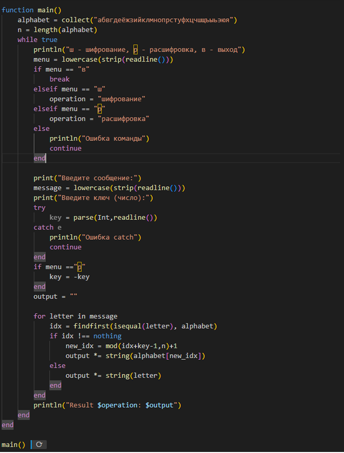
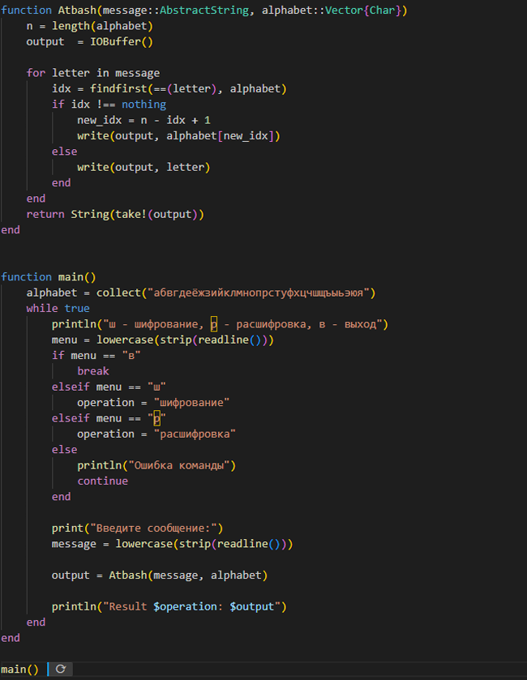

## Докладчик

:::::::::::::: {.columns align=center}
::: {.column width="70%"}

  * Кюнкриков Даниил Саналович
  * студент уч. группы НПИмд-01-24
  * Российский университет дружбы народов
  * 1132249574@pfur.ru
  * https://github.com/DanzanK/2025-2026_math-sec/tree/main

:::

::::::::::::::

## Вводная часть
**Актуальность:**
- Создание кода на Julia (шифра простой замены), чтобы понять принципы работы алгоритмов.

**Объект и предмет исследования:**
- Шифры простой замены (шифр Цезаря и шифр Атбаш)
- Распределенная система управления версиями Git.
- Веб-сервис GitHub
- Язык разметки Markdown

**Цели и задачи:**

- Реализовать шифр Цезаря с произвольным ключом k, Реализовать шифр Атбаш

# Процесс выполнения работы
## Реализация шифра Цезаря с произвольным ключом k на языке программирования Julia

:::::::::::::: {.columns}
::: {.column width="50%"}
{#fig-1 width=60%}
:::
::: {.column width="50%"}
{#fig-2 width=100%}
:::
::::::::::::::

## Реализация шифра Атбаш на языке программирования Julia

:::::::::::::: {.columns}
::: {.column width="50%"}
{#fig-3 width=60%}
:::
::: {.column width="50%"}
{#fig-4 width=100%}
:::
::::::::::::::

## Результаты

- Выполнены все необходимые действия для реализации задач лабораторной работы.

## Вывод

Реализованы шифры простой замены (шифр Цезаря и шифр атбаш)

