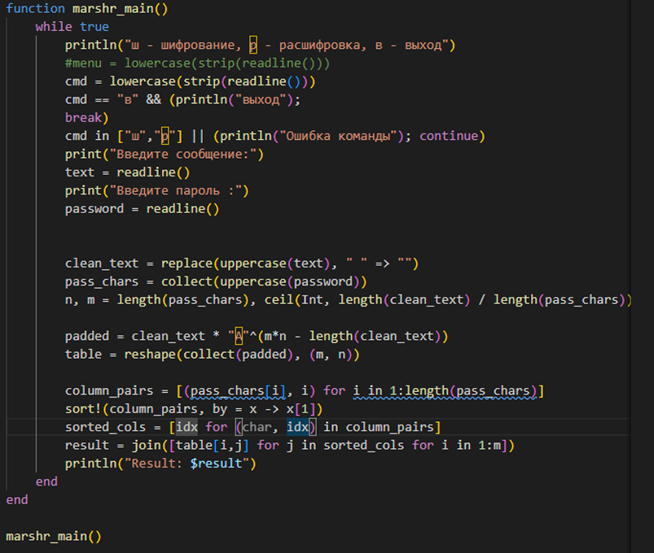
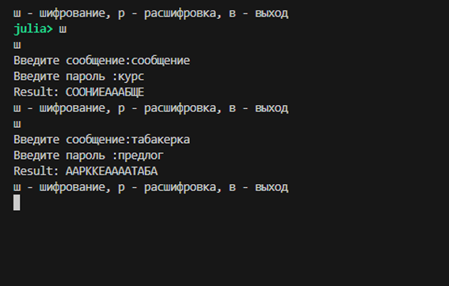

## Содержание

- Цель и задачи
- Маршрутное шифрование
- Шифрование с помощью решёток
- Таблица Виженера
- Примеры и выводы

## Цель и задачи

**Цель:** реализовать шифры перестановки, предусмотренные лабораторной работой.

**Задачи:**
- реализовать алгоритмы (режимы шифрования/расшифровки через меню);
- протестировать работу на примерах;
- оформить отчёт и презентацию.

## Маршрутное шифрование

Идея: текст записывается в таблицу *m×n*, где *n* — длина ключевого слова, затем столбцы переставляются по алфавитному порядку букв ключа и таблица считывается по столбцам.

**Шаги:**
1. Удалить пробелы, привести к верхнему регистру, дополнить до *m·n*.
2. Заполнить таблицу.
3. Отсортировать столбцы по ключу.
4. Считать по столбцам → шифртекст.

## Маршрутное шифрование — реализация

:::::::::::::: {.columns}
::: {.column width="50%"}
{#fig-1 width=80%}
:::
::: {.column width="50%"}
{#fig-2 width=100%}
:::
::::::::::::::

## Шифрование с помощью решёток

Идея решётки: таблица заполняется через “прорези” (маску). После преобразования маски (обычно поворот на 90°) заполняются новые позиции, пока не заполнится вся таблица.

В реализации используется таблица 4×4 (2k×2k при k=2).

## Решётка — реализация (4×4)

:::::::::::::: {.columns}
::: {.column width="50%"}
{#fig-3 width=80%}
:::
::: {.column width="50%"}
{#fig-4 width=100%}
:::
::::::::::::::

## Таблица Виженера

Полиалфавитный шифр: ключ повторяется циклически, каждый символ сообщения сдвигается на величину, соответствующую символу ключа.

Формулы (для алфавита длины *n*):

- шифрование: $C_i = (P_i + K_i)\bmod n$
- расшифровка: $P_i = (C_i - K_i)\bmod n$

## Виженер — реализация

:::::::::::::: {.columns}
::: {.column width="60%"}
{#fig-5 width=60%}
:::
::: {.column width="60%"}
{#fig-6 width=60%}
:::

::::::::::::::

## Виженер — результат

{#fig-7 width=100%}

## Выводы

- Реализованы три алгоритма: маршрутное шифрование, решётка и таблица Виженере.
- Проведены тестовые прогоны на контрольных примерах.
