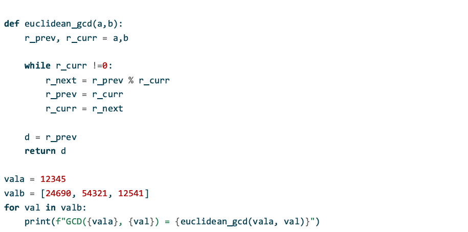
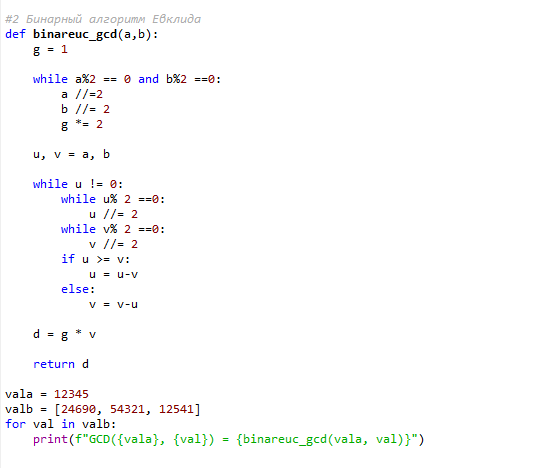
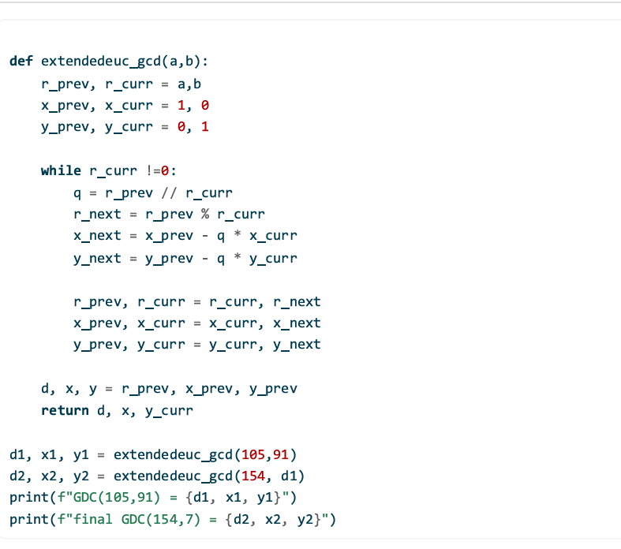
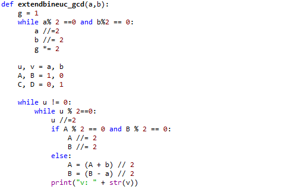
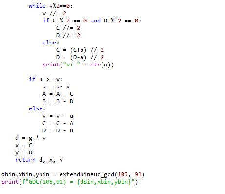

## Содержание
- Цель и задачи
- Теория: НОД и алгоритмы Евклида
- Реализация (Python)
- Примеры работы
- Выводы

## Цель и задачи
**Цель:** реализовать алгоритмы вычисления НОД и (для расширенных версий) коэффициенты Безу.

**Задачи:**
- Евклид
- Бинарный Евклид (Стейн)
- Расширенный Евклид (Безу)
- Расширенный бинарный Евклид

## Теория: ключевые формулы
- Лемма Евклида: если $a = qb + r$, то $\gcd(a,b) = \gcd(b,r)$.
- Тождество Безу: существуют $x,y$, что $ax + by = \gcd(a,b)$.

## Алгоритм Евклида
Итеративно выполняем:
- $r \leftarrow a \bmod b$
- $(a,b) \leftarrow (b,r)$  
пока $b \ne 0$. Ответ: последний ненулевой остаток.

## Бинарный Евклид (Стейн)
Используем свойства:
- если оба чётные: выносим множитель 2;
- делим чётное на 2;
- для нечётных используем вычитание $|a-b|$.

## Расширенные алгоритмы
- **Расширенный Евклид** ведёт коэффициенты $x,y$ вместе с остатками.
- **Расширенный бинарный** поддерживает инварианты:
  - $u = A a + B b$
  - $v = C a + D b$

## Реализация: Алгоритм Евклида (Python)
{#fig-1 width=60%}

## Реализация: Бинарный алгоритм Евклида (Python)
{#fig-2 width=60%}

## Реализация: Расширенный алгоритм Евклида 
Возвращаем $(d,x,y)$, где $ax+by=d$.

{#fig-3 width=50%}

## Реализация: Расширенный бинарный алгоритм Евклида 

:::::::::::::: {.columns}
::: {.column width="60%"}
{#fig-4 width=60%}
:::
::: {.column width="60%"}
{#fig-5 width=60%}
:::

::::::::::::::

## Результат работы программы
Для пар $(12345,24690)$, $(12345,54321)$, $(12345,12541)$ значения НОД у всех реализаций должны совпадать с `math.gcd`.

Для $(105,91)$ проверяем равенство $105x + 91y = d$.
{#fig-6 width=30%}

## Выводы
- Реализованы 4 алгоритма вычисления НОД.
- Для расширенных алгоритмов получены коэффициенты Безу.
- Корректность проверена сравнением с `math.gcd` и равенством $ax+by=d$.
