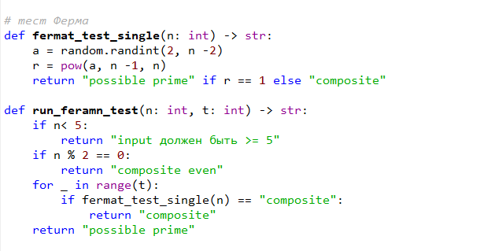
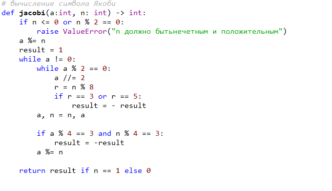
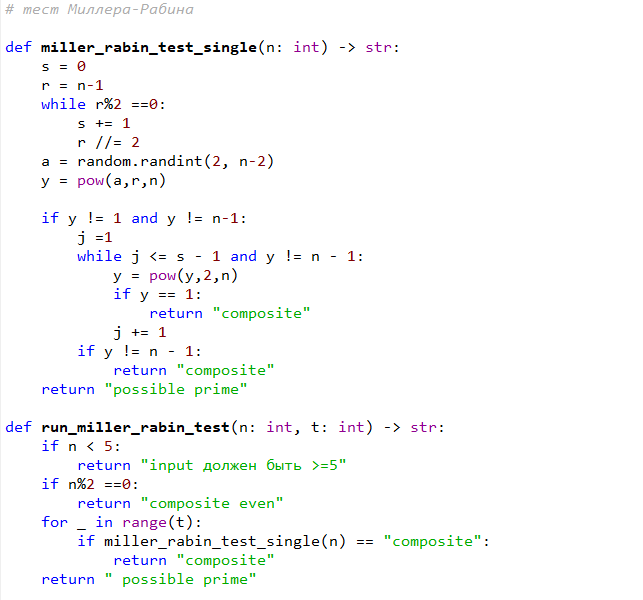

## Цель и задачи
Цель работы: реализовать вероятностные алгоритмы проверки чисел на простоту на Python.

Задачи:
- тест Ферма;
- вычисление символа Якоби;
- тест Соловэя–Штрассена;
- тест Миллера–Рабина;
- демонстрация работы программы.

## Теория: общая схема
Параметры:
- $n$ — проверяемое число;
- $t$ — число раундов;
- $a$ — случайное основание (свидетель).

Алгоритм:
1) выбрать случайное $a$;
2) проверить условие;
3) если условие нарушено — $n$ составное.

## Тест Ферма
Для простого $n$ (и $\gcd(a,n)=1$):
$$
a^{n-1} \equiv 1 \pmod n.
$$
Если $a^{n-1} \not\equiv 1 \pmod n$, то $n$ точно составное.

## Реализация: тест Ферма

{#fig-1 width=50%}

## Символ Якоби
Символ Якоби $(a/n) \in \{-1,0,1\}$ вычисляется по правилам:
- вынесение степеней 2 из $a$;
- квадратичная взаимность (смена знака при $a\equiv n\equiv 3\pmod 4$).

{#fig-2 width=50%}

## Тест Соловэя–Штрассена
Критерий Эйлера для простого $n$:
$$
a^{(n-1)/2} \equiv (a/n) \pmod n.
$$
Если равенство не выполняется — $n$ составное.
Оценка ошибки: $\le 2^{-t}$.

{#fig-3 width=50%}

## Миллер–Рабин
$$
n-1 = 2^s \cdot d,\ d\ \text{нечётное}.
$$
Проверяем цепочку квадратов:
- $y_0 = a^d \bmod n$,
- $y_{k+1} = y_k^2 \bmod n$.

Оценка ошибки: $\le 4^{-t}$.

{#fig-4 width=30%}

## Результаты
{#fig-6 width=50%}

## Выводы
- Реализованы вероятностные тесты простоты: Ферма, Соловэй–Штрассен, Миллер–Рабин.
- Реализовано вычисление символа Якоби.
- Проведена демонстрация работы при различных $n$ и $t$.
