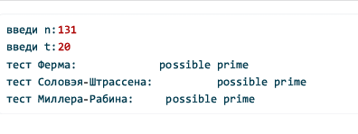

# Введение

В данной лабораторной работе рассматриваются вероятностные алгоритмы проверки чисел на простоту. В отличие от детерминированных алгоритмов, вероятностные тесты используют случайный выбор основания $a$ и по результатам нескольких раундов делают вывод: число $n$ составное или вероятно простое.

Реализованы следующие алгоритмы:

- тест Ферма;
- вычисление символа Якоби $(a/n)$;
- тест Соловэя–Штрассена;
- тест Миллера–Рабина.


## Цель и задачи

Цель работы - Реализовать на языке Python вероятностные тесты простоты и продемонстрировать их работу.

Поставленные задачи: 

1. Реализовать тест Ферма.
2. Реализовать алгоритм вычисления символа Якоби.
3. Реализовать тест Соловэя–Штрассена.
4. Реализовать тест Миллера–Рабина.
5. Провести тестирование работы программы на нескольких входных данных.

# Теоретические сведения

## Обозначения

- $n$ — проверяемое число (кандидат на простоту);
- $t$ — число раундов теста (повторов со случайными основаниями);
- $a$ — случайное основание (свидетель), обычно $2 \le a \le n-2$.

При увеличении $t$ уменьшается вероятность ошибки (принять составное число за простое).

## Тест Ферма

Если $n$ — простое и $\gcd(a,n)=1$, то по малой теореме Ферма:

$$
a^{n-1} \equiv 1 \pmod{n}.
$$

Если для выбранного основания $a$ сравнение не выполняется, то $n$ точно составное. Если выполняется — $n$ вероятно простое (существуют числа Кармайкла, которые могут «обманывать» тест Ферма).

## Символ Якоби

Символ Якоби $(a/n)$ — обобщение символа Лежандра на нечётные $n$ (возможно составные). Значение $(a/n) \in \{-1,0,1\}$. Он вычисляется по правилам вынесения степеней 2 и квадратичной взаимности.

## Тест Соловэя–Штрассена

Для простого $n$ выполняется критерий Эйлера:

$$
a^{(n-1)/2} \equiv (a/n) \pmod{n}.
$$

Если равенство нарушено, то $n$ составное. Для составного $n$ доля оснований, дающих ложный результат, не превосходит $1/2$, поэтому вероятность ошибки не больше $2^{-t}$.

## Тест Миллера–Рабина

Представим
$$
n-1 = 2^s \cdot d, \quad d \text{ нечётное}.
$$

Проверяем последовательность:
- $y_0 = a^d \bmod n$;
- $y_{k+1} = y_k^2 \bmod n$.

Для простого $n$ обязательно выполнится $y_0 \equiv 1$ или для некоторого $k$ будет $y_k \equiv -1 \pmod{n}$. Для составного $n$ доля ложных оснований не превышает $1/4$, поэтому вероятность ошибки не больше $4^{-t}$.

# Выполнение лабораторной работы

Программная реализация Теста Ферма [Листинге №1](#fermat).


### Листинг 1 — Тест Ферма {#fermat}


```python
def fermat_test_single(n: int) -> str:
    a = random.randint(2, n -2)
    r = pow(a, n -1, n)
    return "possible prime" if r == 1 else "composite"

def run_feramn_test(n: int, t: int) -> str:
    if n< 5:
        return "input должен быть >= 5"
    if n % 2 == 0:
        return "composite even"
    for _ in range(t):
        if fermat_test_single(n) == "composite":
            return "composite"
    return "possible prime"

```

Программная реализация алгоритма высчитывания символа Якоби [Листинге №2](#jacobi).


### Листинг 2 — Символ Якоби {#jacobi}

```python
def jacobi(a: int, n: int) -> int:
    """Вычисление символа Якоби (a/n) для нечётного n > 0."""
    if n <= 0 or n % 2 == 0:
        raise ValueError("n должно быть положительным нечётным")
    a %= n
    result = 1

    while a != 0:
        # выносим степени двойки из a
        while a % 2 == 0:
            a //= 2
            r = n % 8
            if r in (3, 5):
                result = -result

        # квадратичная взаимность
        a, n = n, a
        if a % 4 == 3 and n % 4 == 3:
            result = -result

        a %= n

    return result if n == 1 else 0
```

Программная реализация Теста Соловэя-Штрассена показана на Листинге №3(#solovay).


### Листинг 3 — Тест Соловэя–Штрассена {#solovay}

```python
def solovay_strassen_single(n: int) -> str:
    a = random.randint(2, n - 2)
    r = pow(a, (n - 1) // 2, n)

    # быстрый отсев
    if r not in (1, n - 1):
        return "composite"

    s = jacobi(a, n)
    return "possible prime" if r == (s + n) % n else "composite"


def run_solovay_strassen(n: int, t: int) -> str:
    if n < 2:
        return "composite"
    if n in (2, 3):
        return "possible prime"
    if n % 2 == 0:
        return "composite"

    for _ in range(t):
        if solovay_strassen_single(n) == "composite":
            return "composite"
    return "possible prime"
```

Программная реализация теста Миллера-Рабина показана на Листинге №4(#mr).


### Листинг 4 — Тест Миллера–Рабина {#mr}


```python
def miller_rabin_single(n: int) -> str:
    # разложение n-1 = 2^s * d
    s = 0
    d = n - 1
    while d % 2 == 0:
        s += 1
        d //= 2

    a = random.randint(2, n - 2)
    y = pow(a, d, n)

    if y in (1, n - 1):
        return "possible prime"

    for _ in range(s - 1):
        y = pow(y, 2, n)
        if y == n - 1:
            return "possible prime"
        if y == 1:
            return "composite"
    return "composite"


def run_miller_rabin(n: int, t: int) -> str:
    if n < 2:
        return "composite"
    if n in (2, 3):
        return "possible prime"
    if n % 2 == 0:
        return "composite"

    for _ in range(t):
        if miller_rabin_single(n) == "composite":
            return "composite"
    return "possible prime"
```


# Результаты

Пример запуска (для $n=131$ и $t=20$):

Результат запуска программы изображен на @fig-1.

{#fig-1 width=90%}

# Выводы

В ходе выполнения лабораторной работы реализованы четыре вероятностных алгоритма проверки чисел на простоту: тест Ферма, вычисление символа Якоби, тест Соловэя–Штрассена и тест Миллера–Рабина. Программа позволяет запускать тесты для заданного числа $n$ с заданным числом раундов $t$ и получать заключение «составное» или «вероятно простое».

