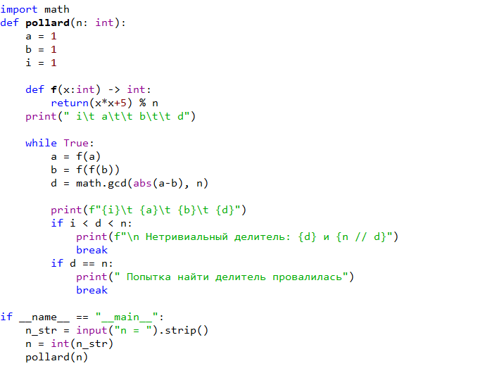

## Докладчик

- Кюнкриков Даниил Саналович
- студент уч. группы НПИмд-01-24
- Российский университет дружбы народов
- 1132249574@pfur.ru
- репозиторий: https://github.com/DanzanK/2025-2026_math-sec/tree/main

## Актуальность

- Факторизация больших чисел используется при анализе стойкости криптосистем (например, RSA).
- ρ-метод Полларда — практичный вероятностный алгоритм для поиска нетривиальных делителей.

## Цель и задачи

Цель: реализовать ρ-метод Полларда на Python и проверить работу алгоритма на тестовом примере.

Задачи:
- реализовать построение последовательности $x_{i+1} = f(x_i)\bmod n$;
- реализовать схему Флойда («черепаха–заяц»);
- получить нетривиальный делитель $1<d<n$ через $\gcd(|a-b|,n)$.

## Идея ρ-метода Полларда

- Выбирается функция $f(x)=x^2+c$ и строится последовательность по модулю $n$.
- Для ускорения поиска коллизии используются два указателя:
  - $a \leftarrow f(a)$
  - $b \leftarrow f(f(b))$
- На каждом шаге вычисляется $d = \gcd(|a-b|, n)$.
- Если $1<d<n$, найден делитель.

## Алгоритм (кратко)

1. Выбрать $f(x)=(x^2+c)\bmod n$, задать $a=b=x_0$.
2. Повторять:
   - $a=f(a)$
   - $b=f(f(b))$
   - $d=\gcd(|a-b|,n)$
3. Если $1<d<n$ → делитель найден; если $d=n$ → перезапуск.

# Реализация

## Код алгоритма 

{#fig-1 width=90%}

## Результаты

Результат работы программы для $n=1359331$ 

{#fig-2 width=90%}

## Вывод

- Реализован ρ-метод Полларда для факторизации.
- Алгоритм успешно находит нетривиальный делитель для тестового $n$.
