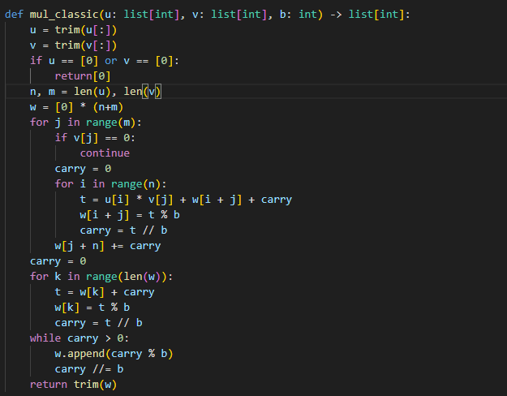
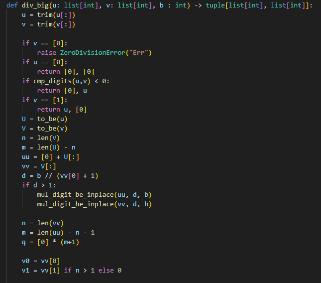

## Докладчик

- Кюнкриков Даниил Саналович
- студент уч. группы НПИмд-01-24
- Российский университет дружбы народов
- 1132249574@pfur.ru
- репозиторий: https://github.com/DanzanK/2025-2026_math-sec/tree/main

## Актуальность
В криптографии и теории чисел часто используются числа, не помещающиеся в стандартные типы данных, поэтому нужны поразрядные алгоритмы "длинной арифметики": сложение, умножение деление и т.д.

## Цель и задачи

Цель работы: программная реализация целочисленных операций многократной точности в основании $b$.

Задачи:

- Выбрать представление числа как массив цифр в основании $b$;
- Реализовать алгоритмы 1-5 (сложение, вычитание, умножение неотрицательных чисел столбиком, умножение быстрым столбиком, деление многоразрядных целых чисел)
- проверить работу на тестовых примерах

## Представление числа

- Основание системы счисления: $b \ge 2$,
- Число хранится как массив цифр:
  - 'dig[0]' - младший разряд,
  - 'dig[1]' - следующий разряд и т.д.
Такое хранение упрощает перенос/заем

## Алгоритм 1 - Сложение

Для каждого разряда:
$$
s = u_j + v_j + k,\quad w_j = s \bmod b,\quad k=\left\lfloor \frac{s}{b}\right\rfloor.
$$

## Алгоритм 2 - Вычитание

При $u \ge v$:
- если $u_j - v_j - k < 0$, то прибавляем $b$ и ставим $k=1$,
- иначе $k=0$

## Алгоритм 3 - Умножение столбиком

- Перебираем разряды второго множителя.
- Для каждого разряда выполняем умножение на все разряды первого с переносом.
- Частичные результаты суммируются в массив результата.

## Алгоритм 4 - Быстрый столбик

- Суммирование производится по диагоналям (по сумме  индексов).
- Для каждой диагонали вычисляем сумму произведений и перенос, затем выделяем цифру $t \bmod b$.

## Алгоритм 5 - Деление с остатком

Требуется найти:
$$
u = qv + r,\quad 0 \le r < v.
$$

В реализации:
- оценка очередной цифры частного по старшим разрядам;
- корректировка, если оцценка завышена;
- нормализация (подход Knuth D).

# Реализация

## Программная реализация алгоритма суммирования

{#fig-1 width=60%}

## Программная реализация алгоритма вычитания

{#fig-2 width=60%}

## Программная реализация алгоритма умножения столбиком

{#fig-3 width=60%}

## Программная реализация алгоритма умножения быстрым столбиком

{#fig-4 width=60%}

## Программная реализация алгоритма деления многоразрядных целых чисел

:::::::::::::: {.columns}
::: {.column width="40%"}
{#fig-5 width=100%}
:::
::: {.column width="36%"}
{#fig-6 width=100%}
:::
::: {.column width="36%"}
{#fig-7 width=100%}
:::
::::::::::::::

## Результат 

{#fig-7 width=80%}

## Вывод

- Реализованы основные операции длинной арифметики с задаваемым основанием $b$
- Показана корректность на тестовых примерах

Данный подход является базой для криптографических и численных алгоритмов, где требуются большие целые числа
